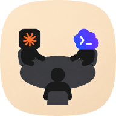

<p align="center">
  
</p>

# Roundtable

Roundtable is a local browser-based forum for developing and refining technical threads with help from AI agents.

It is built around a stable source thread and a surrounding discussion. Humans and agents comment around the thread, critique it, ask questions, and propose changes. When the discussion becomes useful, Roundtable can consolidate it into a proposed next thread for the user to review and apply.

```txt
Thread = source artifact
Discussion points = comments around the source
Consolidation = proposed derived thread
Apply = user-approved next thread
```

Roundtable is designed to feel like a local forum thread with AI commenters and a controlled update flow, not like a chatbot directly editing a document.

## What It Does

- Keeps the current thread as the source artifact.
- Stores approved discussion around that thread.
- Lets Claude and Codex participate as configurable AI commenters.
- Queues agent-proposed discussion points for human approval.
- Builds consolidation proposals from the current thread and approved discussion.
- Lets the user approve whether a proposal becomes the next thread.
- Stores durable state on disk instead of relying on terminal scrollback or hidden agent memory.

## Requirements

You need these tools available on your machine:

- Node.js 20 or newer
- npm
- tmux
- Claude Code CLI, available as `claude` and already authenticated
- Codex CLI, available as `codex` and already authenticated

The app can run as a human-only local forum without agent rooms, but tmux, Claude CLI, and Codex CLI are required for the full agent workflow.

Roundtable does not use Claude or OpenAI API keys yet. Agent rooms run the installed CLIs inside tmux, so they can work with the subscription plans and authentication state already available to your local `claude` and `codex` commands.

## Platform Support

Roundtable currently targets:

- macOS
- Linux

Windows is not a native target yet. The planned path for Windows support is through WSL.

## Getting Started

Install dependencies:

```bash
npm install
```

Start the local development app:

```bash
npm run dev
```

Then open:

```txt
http://localhost:5173
```

The development frontend runs on port `5173` and proxies API/WebSocket traffic to the backend on port `4319`.

## Production Build

Build and start the app:

```bash
npm run start
```

The backend serves the built frontend at:

```txt
http://localhost:4319
```

## How To Use Roundtable

1. Create a thread with the source text you want to develop.
2. Add discussion points around the thread.
3. Start an agent room when you want Claude and Codex to participate.
4. Ask agents to respond to specific discussion points or suggest new top-level discussion.
5. Approve, edit, or reject pending agent discussion before it becomes canonical.
6. Consolidate the thread when the discussion has produced a useful next version.
7. Review the proposed thread update.
8. Apply the proposal only when you want it to become the next source thread.

The important boundary is that agents discuss and propose. The user decides when a proposal becomes durable thread evolution.

## Agents

You can create as many Roundtable agents as you want and give each one its own name, role, instructions, model choice, and color.

Today, every agent must use one of two supported runtimes:

- Claude, backed by the local `claude` CLI
- Codex, backed by the local `codex` CLI

Roundtable starts agent rooms in tmux and launches the selected CLI runtime for each invited agent. Because of that, your CLIs must already be installed and authenticated before starting an agent room.

Direct API-backed agents are not supported yet.

## Local Data

By default, Roundtable stores data in:

```txt
~/.roundtable
```

Set `ROUNDTABLE_DATA_DIR` to use a different storage directory:

```bash
ROUNDTABLE_DATA_DIR=/path/to/roundtable-data npm run dev
```

Useful environment variables:

- `ROUNDTABLE_DATA_DIR` changes the durable data directory.
- `ROUNDTABLE_PORT` changes the backend port. The default is `4319`.
- `ROUNDTABLE_BACKEND_URL` changes the backend URL passed to agent rooms.

## Development

Run the test suite:

```bash
npm test
```

Run type checks:

```bash
npm run typecheck
```

Build all workspaces:

```bash
npm run build
```

## Contact

<table>
  <tr>
    <td><strong>Ashwary</strong></td>
    <td><a href="https://x.com/ashwarysh">@ashwarysh on X</a></td>
  </tr>
</table>
